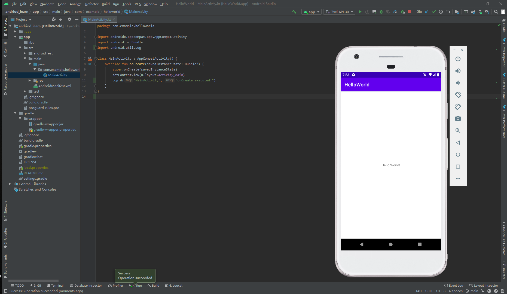

## **Android Learn**

A repo to learn Android.


### **学习资源**

书籍：

-   [第一行代码(第三版)](https://book.douban.com/subject/34996842/)


### **学习进度**

| **项目**                                                  | **日期**   | **说明**     |
| --------------------------------------------------------- | ---------- | ------------ |
| [HelloWorld](https://github.com/JasonkayZK/android_learn) | 2021-01-12 | 开发环境配置 |
| [Kotlin](https://github.com/JasonkayZK/kotlin_learn)      | 2021-01-13 | 学习Kotlin   |
|                                                           |            |              |


### **HelloWorld项目(开发环境配置)**

#### **开发工具安装**

分别安装：

-   JDK 8：https://www.oracle.com/java/technologies/javase/javase-jdk8-downloads.html
-   Kotlin：https://github.com/JetBrains/kotlin
-   Android Studio：https://developer.android.com/studio

>   **Android Studio已自带AndroidSDK；**

安装时最好已经自备梯子；

#### **创建项目**

使用AS创建一个项目：

`Start a new Android Studio project` → `Empty Activity` → `next` → `修改项目名称：Name` → `Finish`；

>   **注意：**
>
>   -   **Language选择Kotlin；**
>   -   **Minimum API Level建议选择API 21，最低兼容Android 5.0(Lolipop)；**

完成后进入依赖安装；

通常Gradle下载会非常的慢，解决方案就是修改Gradle配置`./gradle/wrapper/gradle-wrapper.properties`：

```properties
distributionUrl=https\://code.aliyun.com/kar/gradle-bin-zip/raw/master/gradle-6.5-bin.zip
```

>   关于Gradle更多问题，见：
>
>   -   海外Github Pages：[解决Android项目下载Gradle速度极慢的问题](https://jasonkayzk.github.io/2021/01/13/%E8%A7%A3%E5%86%B3Android%E9%A1%B9%E7%9B%AE%E4%B8%8B%E8%BD%BDGradle%E9%80%9F%E5%BA%A6%E6%9E%81%E6%85%A2%E7%9A%84%E9%97%AE%E9%A2%98/)
>   -   国内Gitee镜像：[解决Android项目下载Gradle速度极慢的问题](https://jasonkay.gitee.io/2021/01/13/%E8%A7%A3%E5%86%B3Android%E9%A1%B9%E7%9B%AE%E4%B8%8B%E8%BD%BDGradle%E9%80%9F%E5%BA%A6%E6%9E%81%E6%85%A2%E7%9A%84%E9%97%AE%E9%A2%98/)

#### **配置模拟器并运行项目**

点击两下`Shift`，或者找到上方工具栏的`AVD Manager`，进入模拟器管理页面；

点击左下角的`Create Virtual Device`，创建一个虚拟设备；

选择机型 → 选择系统镜像(目前最高可以选择到Android 11(R)) → 下载镜像 → 完成

配置虚拟设备完成后，点击上方的运行即可启动虚拟设备并运行和测试Android APP了；

效果见下图：



